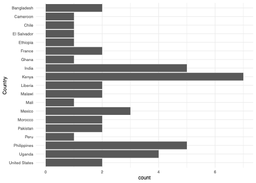
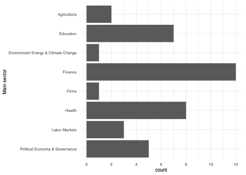
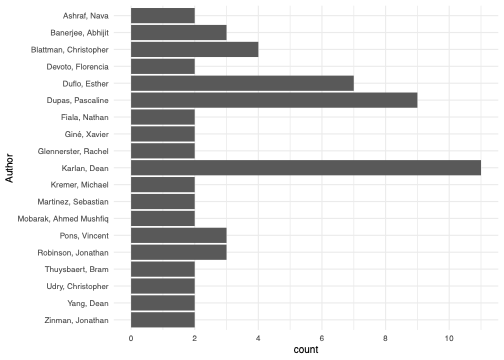

We use imperfect compliance RCTs for this project. 
An imperfect compliance RCT is an RCT where the randomised manipulation does not perfectly determine program take-up, for instance, if take-up depends on a choice by the participant(s). 
In other words, if there is a correlation of less than 1 between assignment to treatment and take-up of treatment then there is imperfect compliance. 
We make a distinction between three types of imperfect compliance RCT:

  1. [Eligibility Designs](https://chabefer.github.io/STCI/RCT.html#sec:design3): RCTs in which there is imperfect compliance in the manipulated group only. 
  No-one takes up the program in the non-manipulated group and only some of the members of the manipulated group take up the program.
  2. Reverse Eligibility designs (these are rare): RCTs in which there is imperfect compliance in the non-manipulated group only. 
  Everyone takes up the program in the manipulated group, but some of the members of the non-manipulated group also take up the program.
  3. [Encouragement Designs](https://chabefer.github.io/STCI/RCT.html#sec:design4): RCTs in which there is imperfect compliance both in the manipulated and the non-manipulated groups. 
  There is a positive but not 100\% take up of the program in both groups and usually greater take-up in the manipulated group. 
  Designs are only feasible encouragement designs if take-up of the program can be observed in both the manipulated and the non-manipulated group.

A study is included in our analysis if all of the following are present:

  1. Variable(s) measuring the experimental manipulation(s) (e.g. eligibility/encouragement for a program). 
  Usually these will be binary, if not we have to transform them into a binary variable.
  2. Variable(s) measuring take-up of a program of interest. 
  Usually these will be binary, if not we have to transform them into a binary variable.
  3. At least one outcome variable that we believe is influenced by the program.
  4. Imperfect compliance with the experimental manipulation in program take-up.

# Search for Imperfect Compliance RCTs

Our search domain was all of the datasets from the J-PAL and IPA Dataverses. 
Our final search of the two Dataverses was on 3rd August 2022, at which point there were 207 datasets available.

We used the J-PAL and IPA Dataverses for a number of reasons. 
Firstly, these are the two most prominent organisations that run randomised controlled trials in development economics. 
Secondly, these repositories had a large number of studies available on them so we expected to find many suitable datasets for our project.

We webscraped the meta-data from all 207 of the studies on both Dataverses. 
This includes author names, paper title, year of publication, DOI where available, and so on. 
After we scrape the meta-data, each study goes through a three-step screening process from the initial scrape to being included in our study.

  1. **Pre-screening:** at *Level 1*, for each repository, we pre-screen all projects to eliminate those datasets that are definitely not suitable for our analysis -- often non RCT data or RCTs with full compliance. 
  2. **Screening:** at *Level 2*, we perform an in-depth screening of the projects that could proceed from *Level 1* to *Level 2*.
  The objective of this step is to get an understanding of the information potentially available in the dataset to a) once again eliminate papers that are not deemed suitable after further scrutinizing (this could for example happen if the authors do not collect a measure of imperfect compliance) or b) to obtain a set of basic information about the paper such as the available outcome measures, the randomization and participation variables and other metadata relevant for *Level 3*.
  3. **Data preparation:** the papers that pass *Level 2*, move on to *Level 3*.
  We now collect information from the dataset itself to prepare the econometric analysis.
  The goal of this stage is to prepare a clean dataset for each project where outcome, treatment, treatment uptake and control variables are stored.
  This step involves *data cleaning*.
  Eventually, each project dataset stores the relevant variables in a harmonized way with one row for each specification ready to be read by our bias estimation code package.

Of the 207 JPAL and IPA datasets we screened: 

  * 123 passed level 1 screening,
  * 85 of them passed level 2 screening,
  * 40 of them passed level 3 screening and are included in our analysis.

# Description of the final dataset

Let us first describe the datasets that we have included in our analysis, focusing on country, sector/topic, journal and authors.

```{r CountriesPlot, echo = FALSE, message=FALSE, include=TRUE, fig.align='center', fig.cap='Countries represented in the analysis',out.width='45%',fig.pos='H'}

```

Our studies come almost entirely from developing countries, as this is where J-PAL and IPA mostly operate. 
We have studies from Africa, South America, and Asia, as well as North America (USA) and Europe (France). 
Studies from countries with IPA or J-PAL hubs are strongly represented in our dataset, similarly to the development economics literature more broadly. 
Kenya appears the most in our analysis, with India, the Philippines, Uganda and Mexico also being highly represented. 

```{r SectorPlot, echo = FALSE, message=FALSE, include=TRUE, fig.align='center', fig.cap='Sectors represented in the analysis',out.width='45%',fig.pos='H'}

```

The most represented sectors are finance, education and health, all common areas of study within development economics. 
Note that we only have one study in each of environment and firms, so when we look at heterogeneity according to these sectors later, we should not expect the results to be particularly generalisable, whereas we can be more confident in the sectors with more results.

```{r JournalPlot, echo = FALSE, message=FALSE, include=TRUE, fig.align='center', fig.cap='Journals represented in the analysis',out.width='45%',fig.pos='H'}
knitr::include_graphics("./figures/journal.png")
```

The studies in our analysis also represent those published in top journals. 
We have nine papers from top-five journals in economics: four papers from The Quarterly Journal of Economics, three from the American Economics Review, and one each from Econometrica and the Journal of Political Economy. 
Eight of our studies come from the American Economic Journal: Applied Economics. 
This journal publishes many randomised controlled trials and enforces its data availability policy which means it is the most strongly represented journal in our study. 
We also have a few studies published in non-economics journals, signifiying our breadth of coverage: American Political Science Review, the Journal of Politics, PLoS One, PNAS and Science. 
We do not cover many development field journals, only having two studies from the Journal of Development Economics.

```{r AuthorPlot, echo = FALSE, message=FALSE, include=TRUE, fig.align='center', fig.cap='Authors represented in the analysis',out.width='45%',fig.pos='H'}

```

We show authors which appear at least twice in our dataset. 
Almost all of these authors are prominent development economists, with Dean Karlan, Pascaline Dupas and Esther Duflo all appearing most frequently, with at least seven papers each. 
This suggests that even though not many of our studies are published in development field journals, they are still likely to be representative of the development economics literature more broadly.


