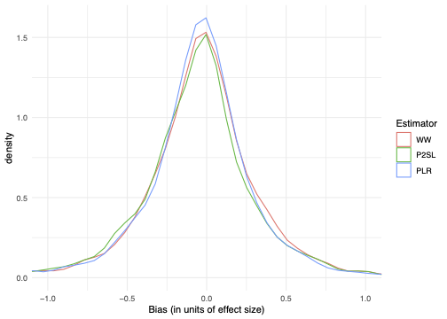
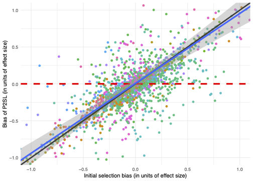

Let us first plot the distribution of our bias estimates for our three observational estimators, with-without (WW), post double selection lasso (P2SL) and partially linear regression (PLR). 
The units of bias are normalised to a common effect size by dividing by the control group standard deviation.
These distributions should be interpreted with caution as they are just estimates of the bias and contain noise.

```{r RawBiasPlot, echo = FALSE, message=FALSE, include=TRUE, fig.align='center', fig.cap='Distribution of the bias of observational methods',out.width='65%',fig.pos='htbp'}

```

Visually, the distribution of the estimators are all roughly similar from the -1 to +1 range. 
The distributions are centered at approximately -0.06. 
This means that on average, the estimated observational treatment effect is 0.06 standard deviations smaller than the experimental treatment effect. 
This small difference in effect sizes is not often likely to be economically significant.
The density of P2SL is lower than that of PLR at 0. This means that PLR has more estimates that are the same or very similar to the experimental estimate.
Although the standard deviation of the three estimators look the same in from the -1 to +1 range, in reality WW and PLR have a standard deviation of approximately 0.48 while the standard deviation of P2SL is 1.51, or three times larger, because of outliers. 

We can also plot the bias of each observational method as a function of the amount of selection bias before any correction is implemented.
We show a scatter plot and a loess line of best fit for both estimators. 
For both plots we also show the 45 degree line in black and a horizontal red dashed line intercepting at 0. 
Ideally, our bias estimates would lie on the horizontal red line, as this would mean that whatever the initial selection bias, the observational estimator is able to reduce the bias to 0. On the other hand, if the bias estimates lie on the 45 degree line, this implies that the observational methods are unable to reduce selection bias.

```{r CorrBiasPlot, echo = FALSE, message=FALSE, include=TRUE, fig.align='center', fig.cap='Bias of observational methods as a function of selection bias',fig.subcap=c('P2SL','PLR'),out.width='45%',fig.pos='htbp'}

knitr::include_graphics("./figures/scatter_plr_ww.png")
```

The points are much closer to lying on the 45 degree line than the horizontal, meaning that the observational methods are far from solving the entire issue of selection bias. 
The loess line of best fit for both plots is slightly shallower than the 45 degree line, meaning that the estimators are able to slightly reduce the bias, at least at the extremes.
Finally, the loess line is farther away from the 45 degree line in the PLR case, suggesting that this estimator slightly overperforms P2SL.

# Meta-analysis of the bias of observational methods

Below are the results of the meta-analysis.

```{r tables-mtcars,echo=FALSE}
ResultsMA <- matrix(c(-0.0231,0.0031,-0.0237,0.0407,0.0232,0.0229,0.3007,0.2108,0.433,40,40,40,2108,2108,2108),ncol=3,nrow=5,byrow=T)
colnames(ResultsMA) <- c("WW","PLR","P2SL")
rownames(ResultsMA) <- c("Mean","SE","$\\hat\\varsigma$","N. of studies","N. of contrasts")
knitr::kable(ResultsMA, caption = 'Results of the meta-analysis of the bias of observational methods',digits=3,align=c('l','c','c','c'))
```

We estimate a mean bias of -0.02, 0.00 and -0.02 for WW, PLR and P2SL respectively. 
These estimates are all smaller (closer to zero) than the estimates from the raw biases. 
We can also see that none of the estimates are statistically significantly different from zero. 
This means that once we account for the issue of varying precision and correlated outcomes, the average bias of observational methods is zero. 

The standard deviation of the bias is not zero, though.
Our estimates of $\hat{\varsigma}$ are smaller than the raw standard deviations of the biases, but they are not null. 
P2SL still has a higher standard deviation than WW or PLR, but the difference between them is much less now.

From the meta-analysis results, we can conclude that the observational estimators are unbiased on average with the distribution of the bias of each estimator being centered at zero. 
However, the estimators do differ in their standard deviation. 
The WW selection bias distribution has a standard deviation of 0.30. 
The PLR standard deviation is only 0.21. 
This suggests that PLR is able to somewhat deal with the selection bias and pull the tails of the distribution with large positive or negative bias towards zero.
P2SL on the other hand has a standard deviation of 0.43, greater than the standard deviation of the WW estimator. 
This suggests that, even when accounting for varying levels of precision and correlated biases, the P2SL estimator makes the selection bias problem worse, or equivalently, performs worse than a simple comparison of takers to non-takers. 

Our results suggest that, to account for the existence of unobserved confounders, one should widen the usual confidence intervals by $\pm 0.60$ for the WW estimator, $\pm 0.42$ for the PLR estimator and $\pm 0.86$ for the P2SL estimator.
Such large levels of uncertainty on the size of the true treatment effects  will call for using RCTs in place of observational methods very often.